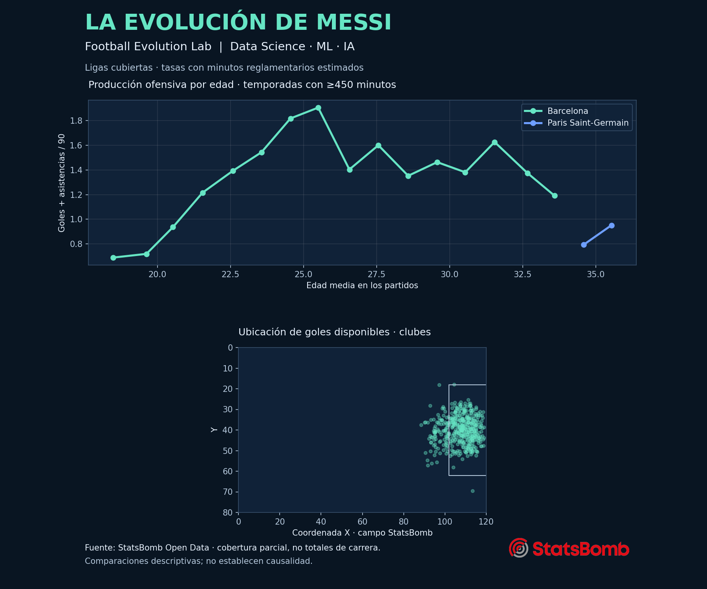

# ⚽ Football Evolution Lab
## La evolución de Messi: de promesa a leyenda
**Data Science · Machine Learning · AI · Reproducible football analytics**



Un repositorio para investigar la evolución de Lionel Messi, crear contenido respaldado por datos y ampliar el análisis a otros jugadores. Interfaz en español.

### Inicio rápido
```bash
python -m venv .venv
source .venv/bin/activate  # Windows: .venv\Scripts\activate
pip install -e '.[dev]'
python -m football_lab.pipeline
python -m football_lab.analysis
python scripts/export_page.py
python scripts/publication_cards.py
python -m streamlit run app.py
```
En Windows puedes ejecutar `run_windows.bat` después de instalar Python.

La primera descarga puede tardar varios minutos y requiere Internet. Para probar rápidamente: `python -m football_lab.pipeline --limit 20`. La muestra se identifica en el manifiesto; no debe presentarse como toda la carrera. Ejecuta después el pipeline sin límite para reemplazarla.

### Qué funciona
- Ingesta StatsBomb fijada a una revisión, caché, reintentos y manifiesto con hashes.
- Estadísticas por partido y temporada: goles, asistencias, minutos reglamentarios estimados, tasas por 90, xG, pases, regates y pases que generan disparos.
- Clubes y selección separados; filtros por equipo y temporada.
- Mapa de disparos/goles, distancia aproximada, pie/cabeza, tipo, densidad y animación.
- Clustering con estandarización, selección por silhouette y semilla reproducible.
- Curva de edad Ridge y comparación retrospectiva con baseline mediante LOOCV.
- Índice de impacto basado en percentiles y pesos configurables.
- Comparación descriptiva del equipo en intervalos on/off dentro de los partidos cubiertos.
- Herramienta de ranking verificable; IA opcional convierte lenguaje natural en argumentos validados. Nunca ejecuta SQL generado por el LLM.
- CSV para Power BI, DuckDB para SQL y JSON/HTML para una futura página.
- Registro inicial de títulos de Barcelona con fuentes; catálogo ampliable, no un palmarés completo actualizado.

### Cobertura real
StatsBomb ofrece la biografía de liga de Barcelona 2004/05–2020/21, PSG 2021/22–2022/23 y MLS 2023; se añaden partidos de Argentina de Mundiales 2018/2022 y Copa América 2024 disponibles en la revisión. **No incluye toda competición, toda aparición ni toda la carrera hasta la actualidad.** Revisa `data/processed/manifest.json` y la tabla de cobertura. Argentina coincide con los clubes temporalmente; no es una cuarta etapa secuencial.

### IA opcional
Configura `OPENAI_API_KEY` y, si deseas, `OPENAI_MODEL` en el entorno; consulta `.env.example`. Sin clave funcionan todas las métricas, visualizaciones y ML. La integración usa una API externa y puede generar cargos; no se activa automáticamente. La IA responde solo rankings por temporada en esta versión; devuelve evidencia estructurada, no un relato libre con cifras inventadas.

### Datos y licencia
Código propio: MIT. Datos: **StatsBomb Open Data**, sujetos a su acuerdo específico, **no MIT**. La cláusula 1.2.1 restringe redistribuir los datos y la 1.2.2 el uso comercial. Por ello los datos crudos/normalizados y las exportaciones de datos se generan localmente y no se distribuyen en el repositorio. Las publicaciones de análisis deben incluir el crédito y logo StatsBomb. Ver [acuerdo](docs/StatsBomb-LICENSE.pdf), [fuente](https://github.com/statsbomb/open-data) y [media pack](https://statsbomb.com/media-pack/). El logo se conserva como marca ajena únicamente para atribución.

### Extender a otros jugadores
La extracción y agregación usan `player_id`, no el nombre Messi. Para analizar otro jugador en las mismas competiciones:
```bash
python -m football_lab.pipeline --player-id ID --birthdate YYYY-MM-DD --teams 'Barcelona' 'Argentina'
```
Esto reemplaza el dataset local del estudio. Para otro universo de competiciones, adapta `selected` en el pipeline y registra su cobertura. La versión 0.1 analiza un jugador por ejecución; el modelo de datos incluye identificadores para una futura colección multijugador.

### Validación
```bash
pytest -q
python scripts/validate_data.py
```
Consulta [metodología](docs/methodology.md), [diccionario](docs/data_dictionary.md), [Power BI](docs/power_bi.md) y [roadmap](docs/roadmap.md).

## Investigación y publicaciones

Nuevo análisis de participación ofensiva, intervalos de incertidumbre y validación temporal: [research/README.md](research/README.md). Incluye generador de gráficas editoriales con fotografía acreditada, formatos LinkedIn y X y descarga desde el dashboard. Los resultados son exploratorios y la cobertura es parcial.
